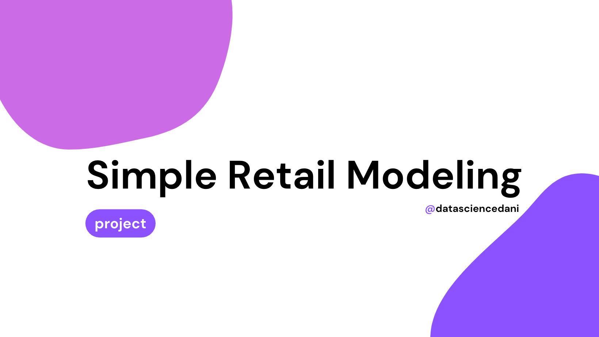
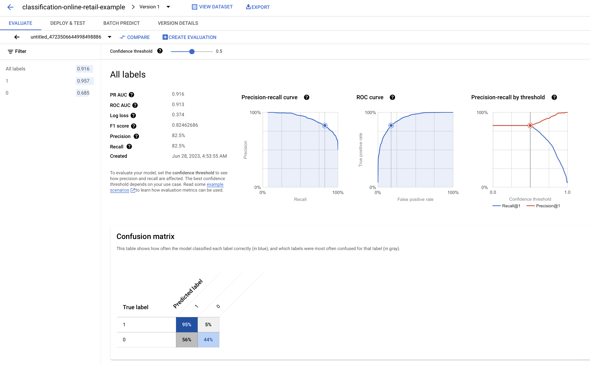
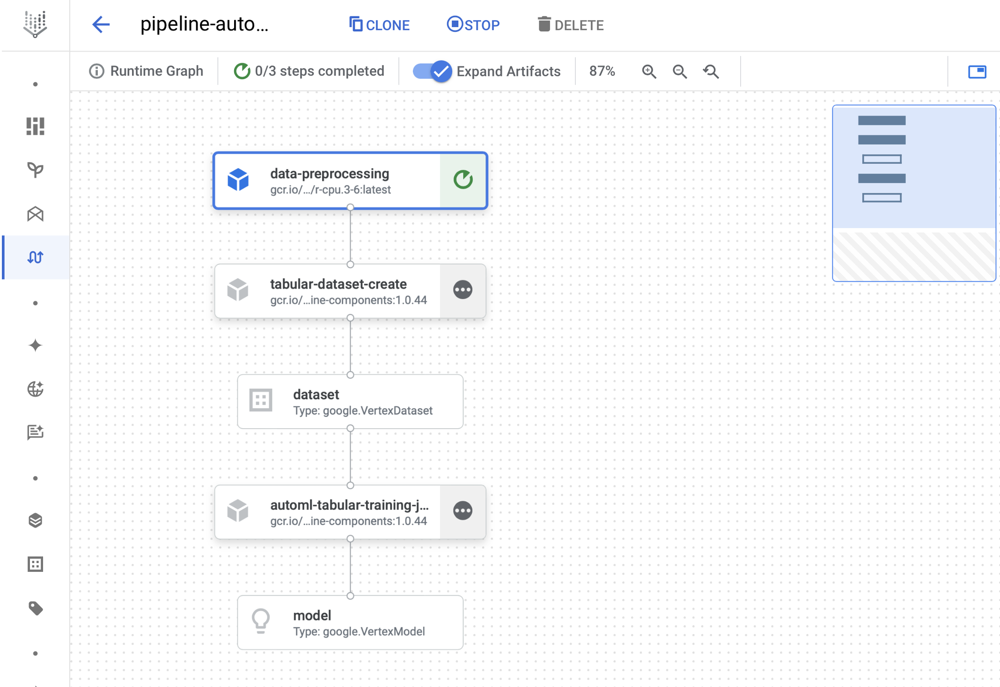
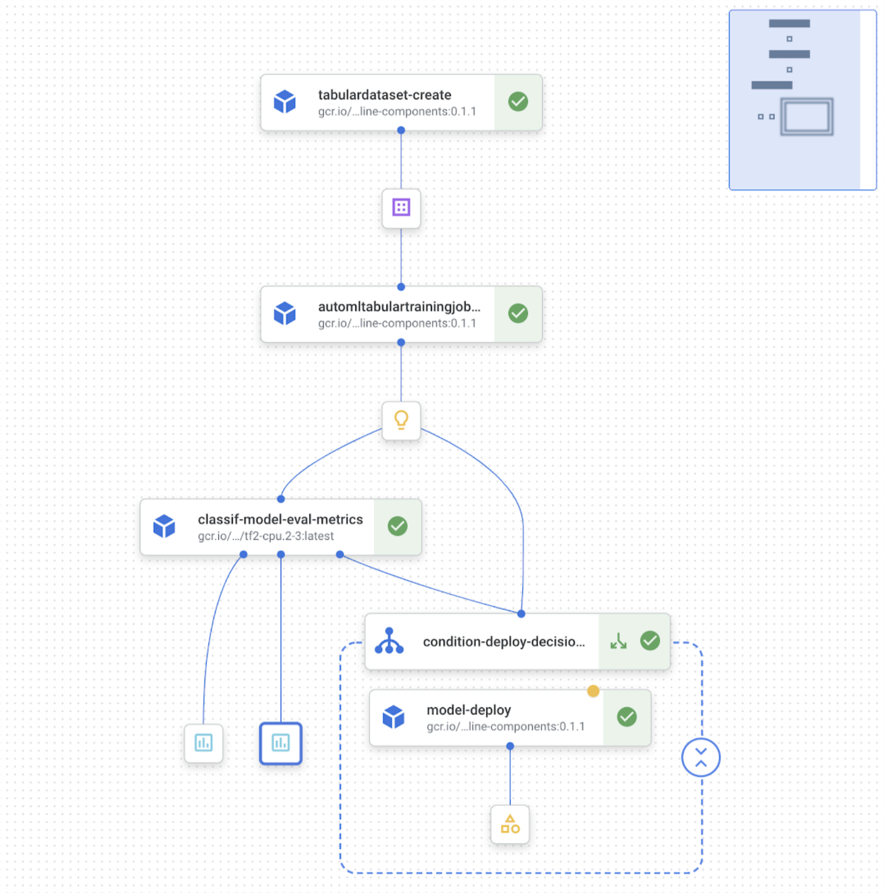

## About 🔎

This repository contains a first approach to the intent of modeling with an online retail dataset. The dataset contains a year of transactions made between December 2010 and December 2011.

The columns we find on the data are: 
- Date of the transaction
- Transaction ID
- Product Stock Code
- Product Description
- Product Quantity
- Product Unit price
- Customer ID

We have an entrance for each product bought on a transaction.

Our main objective is to check if we can use this data to predict if a **customer will buy in the future or not**. Translating this objective to the business: why would we want to predict the probability of a customer having a future purchase? We could detect the customers that will not buy and target them with discounts and marketing (saving the cost of applying discounts to customers that were already going to buy).

## Content 🚀

### Data exploration & preparation 

The first thing we did in our project was explore the data and prepare it for modeling (see [EDA & Preparation Notebook](notebooks/00_eda_and_prep.ipynb)). We analyzed each variable and did transformations as justifying the removal of missing `CustomerId` values, scoping our modeling to the United Kingdom market, and identifying and removing useless transactions (as system transactions or cancellation captures).

For further analyses we propose: 
- Expanding the analysis to other markets outside the UK.
- Analyzing Pro customers (customers with very high quantity orders).

### Label & Feature creation

The next thing we did was create our label (`FuturePurchase`) and features:
- A text variable with the descriptions of all the products bought by a customer in a transaction.
- The total paid by the customer.
- The date of the purchase.
- The purchase number for that customer (1st purchase, 2nd purchase, etc).

### Modeling POC

With the created variables, the next thing we wanted to do was test our hypothesis. Can we use those features (and our created label) to predict if a customer will make a future purchase?

We decided to test our model hypothesis using [Google Cloud's AutoML](https://cloud.google.com/vertex-ai/docs/tabular-data/tabular101) (see [Modeling POC PDF](assets/docs/00_modeling_poc_automl.pdf)). AutoML is a great alternative to test a Machine Learning model without taking a lot of time in feature preparation and model selection. AutoML performs [variable transformations](https://cloud.google.com/vertex-ai/docs/datasets/data-types-tabular) and uses ensemble tree-based/deep-learning techniques to create a model.

Unfortunately, our resulting model was not having a great performance identifying customers that would not make a future purchase. But we could link this behavior back to the way we were obtaining our problem's label. Overall, this first approach was incredibly helpful to identify possible causes of unwanted behavior so that we would be able to iterate and try different ways of creating features and labels to solve our problem. 

In the [Modeling POC document](assets/docs/00_modeling_poc_automl.pdf), you will find we propose obtaining the new label by using more information on the distribution of time between purchases. Removing assumptions about customers' next purchase if we don't have enough information.

The next steps on our modeling journey would be:
- Perform experiments with new label calculation.
- Engineer features that would provide our model more context on the customers' purchase history (as the time since the last purchase, or different techniques to embed and aggregate purchase product descriptions).
- Try out custom-trained models (start with tree-based to handle highly skewed variables) and perform experiments with hyperparameter tuning.

### Beginnings of Model Deployment

The final thing we did on our project was prepare for model deployment. Machine Learning pipelines are used to orchestrate and automate workflows as model training. A pipeline component is simply the containerized code that performs a step in your workflow. Remember we performed a series of steps to transform our source data into the modeling dataset we would use as input for our model? Under the `src/components` folder, you will find the [Python script](src/components/data_preprocessing_00.py) that contains an automation of those data transformations. This component could be part of a training and inference pipeline. 

What we did to show a glimpse of further work was creating a simple training pipeline, performing a data preprocessing step, followed by the creation of a dataset (data version control), and training a model (see [Pipeline Code](src/pipeline.py)).

We build our model pipeline using the [Kubeflow SDK](https://cloud.google.com/vertex-ai/docs/pipelines/build-pipeline#build-pipeline) and leveraging the [library of pre-written components](https://cloud.google.com/vertex-ai/docs/pipelines/gcpc-list) provided by Google.

A next step in building the pipeline would be adding model evaluation and a deployment condition (if we want to deploy or model to an endpoint to generate online predictions).

> Source: [Use Vertex Pipelines to build an AutoML classification end-to-end workflow](https://cloud.google.com/blog/topics/developers-practitioners/use-vertex-pipelines-build-automl-classification-end-end-workflow)

Additionally, it's important to plan for model performance and data monitoring, automate pipeline running (scheduling or triggering), and set up a CI/CD environment.

    🚨Disclaimer:

    We created this project in less than a day. Our main objective is to show how we can leverage cloud services to build the foundations of a robust Machine Learning project.  

- - -
Any suggestions or doubts? Please reach out! I'll be happy to connect.

**👥 LinkedIn:** [linkedin.com/in/datasciencedani](http://www.linkedin.com/in/datasciencedani)  
**🐦 Twitter:** [twitter.com/datasciencedani](https://twitter.com/datasciencedani)  
**📨 Email:** [danizhorta24@gmail.com](danizhorta24@gmail.com)  
**🌐 Site:** [datasciencedani.super.site](https://datasciencedani.super.site)
